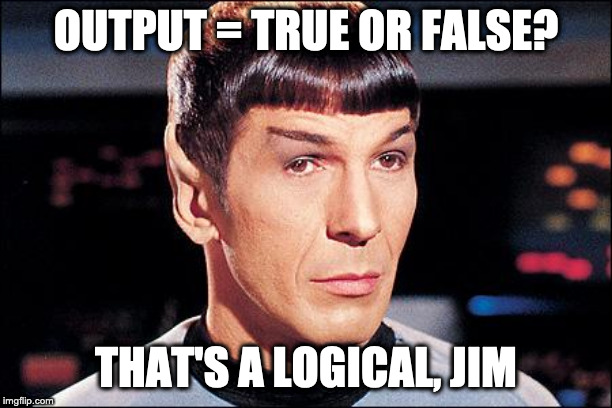

# Introduction to `R` / getting to know your data

This week we aim to suppliment the assigned readings and homework with a few blurbs and examples in `R`. We will go over how to install packages and load data into the `R` environment, and will discuss how to build your own functions in `R`. This wrap-up assumes that you've worked through this weeks DataCamp assignments.

Two of the first skills that you are going to need to learn are 1) how to install / load your required packages into the `R` environment and  2) how to import data from a file. More often than not, these will be the first two steps of your analysis (though if you are working on more complex projects you may find it easier to keep track of things if you load import your data and packages as needed). 


## Installing and loading an `R` package:

On of the great things about `R` is its exensibility via packages. For other great things about `R` (or how to sell `R` to your peers) see [this link](https://simplystatistics.org/2017/10/30/how-do-you-convince-others-to-use-r/) on [simplystatistics.org](https://simplystatistics.org). In fact this blog is a great resource for staying in contact with topics and new developments in data analysis.

From Peng's article:

> "With over 10,000 packages on CRAN alone, [there’s pretty much a package to do anything](https://youtu.be/yhTerzNFLbo). More importantly, the people contributing those packages and the greater `R` community have expanded tremendously over time, bringing in new users and pushing `R` to be useful in more applications. Every year now there are probably hundreds if not thousands of meetups, conferences, seminars, and workshops all around the world, all related to R."

For example, in my own work I often find myself not only using statistical techniques such as growth curve modeling (package: `lmer`) but also advanced quantification techniques such as cross recurrence quantificantion analysis (package: `crqa`), MultiFractal Detrended Fluctuation Analysis (package: `MFDFA`), and Sample Entropy (package: `TSEntropies`). Ten years ago this involved 100's of lines of custom programming to carry out these analysis... today, there's an `R` package for that—i.e., someone else likely with far greater programming abilities than I has already done it.


### Installing a package using the GUI

For the point-and-click crowd, the easiest way to install an `R` package is to locate the `Packages` tab in your Window. From here you can click install. From there you can type in the package that you wish to install. So for example, let's install the `psych` package, which is useful for obtaining descriptive stats from your data (although to be honest I hardly use it). Check out an example from [this video](get youtube link).

As you see the video, I left the `Install dependences` box ticked. *You should always install with dependencies*, this automatically installs other packages that may be required for `psych` (or whatever package of interest) to work. You may have also noticed when after you clicked OK, `R` entered this line of code into your `Console`.

```install.packages("psych")```


Which leads us to...

### Installing packages with `install.packages()`

A basic install of `R` comes with the `base` package which has an unbelievably large number of functions and analyses built in. However learning `base` `R` has a somewhat steep learning curve, especially for those with no programming experience. In this course we will use many of the simple functions in `base` R, but for more complex data wrangling (sorting, structing our data), statistical analysis, and plotting we will use the wonderful `tidyverse` package. `tidyverse` piggybacks on the basic install, replacing the sometimes bewildering `R` syntax with more natural language. Here, we'll use `tidyverse` as an example of how to install from command line.

Installing `tidyverse` (or any package for that manner) couldn't be easier. At the prompt (or in your notebook) simply type:

```{r eval=FALSE}
install.packages("tidyverse")
```

Congratulations you have installed over 70 new packages to your `R` environment!

You see, `tidyverse` is not a single package (as is usually the case), but a collection of packages that function seamlessless with one another abiding a shared ethos of data science practices (who knew there were ethoses in stats! A simple google search of `tidyverse` might lead you to believe that you have joined a cult with Hadley Wickham as your leader!). The core value is that data should be structured, analyzed, presented, and shared in a manner that is as transparent as possible. In this class, we aren't going to go the "full Hadley" (all the way down the rabbit hole) but we are going to abide many shared principles (it's just good science!).


Note for the `crqa` package I simply type `install.packages("crqa")` and for `MFDFA` `install.packages("MFDFA")`. You noticing a pattern here?

### An IMPORTANT note on knitting with install.packages:

One quirk with knitting from your source is that you will need to specify which CRAN mirror you will download the package from. The Comprehensive `R` Network (CRAN) is an online repository that houses almost all things R, including packages. There are multiple mirrors set up all over the globe (https://cran.r-project.org/mirrors.html) and you need to tell `R` which one is your preferred choice. The quirk is that you only need to do this when knitting/compiling. You don't need to do this for other everday use, but your source often will not compile unless you fix this. See [here](https://stackoverflow.com/questions/33969024/install-packages-fails-in-knitr-document-trying-to-use-cran-without-setting-a) to read more about the error this produces.

Since your homework is going to involve knitting you should probably get in the practice of fixing this. There are two ways to resolve this issue. The first is to simply add the `repos` argument to your `install.packages()` command like so:

``install.packages(package name, repos="http://cran.us.r-project.org")``

Using this method you would need add the `repos` argument and url to every item you wish to install.

A better, more efficient way is to provide a default repo at the outset. This can be accomplished by creating a new chunk at the beginning of your Rmd file (right underneath your header), and inserting the following:

    setRepositories(graphics = getOption("menu.graphics"),  
    ind = NULL, addURLs = character())
    r <- getOption("repos")
    r["CRAN"] <- "http://cran.cnr.berkeley.edu/"
    options(repos = r)

### Loading packages with `library()`

Once you have installed a package, it remains stored on your hard-drive until you delete it (which you'll amost never do, packages take up so little disk space it's really not efficient to install and uninstall unless absolutely necessary). What many new users have difficulty getting used to is that just because a package is _installed_ does not mean that it is _loaded_. To load a package we typically use the `library()` command. For example to load `tidyverse`, we can type:

```{r}
library(tidyverse)
```

That's it, easy-peasy. Note that by default, only the `base` packages are typically loaded when you start a new session. Therefore, *a useful practice to get into is to load the necessary packages at the start of every session.*

Before moving on, I'd like to point out two things. First, notice that when installing with `install.packages()` we included quotations around the package name, but with `library()` we did not. Knowing when to use quotes and when not to is one of the more frustrating things to grasp for beginners (and even is an annoyance for me from time to time). All I can say is with practice, it becomes automatic. In truth, in the case of `library()` whether you include the quotes or not doesn't matter (the default is to not), but for many functions, including `install.packages()`, the proper quotes do matter (for example: `install.packages(tidyverse)` will result in an error). 

Second, while installing `tidyverse` installs over 70 packages on your computer, `library(tidyverse)` only loads 8 or so primary packages. This isn't really much of an issue as we will be mostly using this common `tidyverse` packages, but it's worth mentioning for future reference. Finally, when you loaded `tidyverse` it likely gave you a message about *Conflicts*. Conflict arise when different packages use the same names for functions. For example, the message:
```dplyr::filter() masks stats::filter()``
is telling you that both `stats` and `dplyr` have a function called `filter()` and that `dplyr` is the default. This means that if you execute `filter()` by itself it will default to the `dplyr` version. If you ever find yourself in a situation were a function you know should be working isn't, first check to be sure `R` is indeed calling from the correct package. That said this can be avoided by getting in the habit of using the `library::function()` convention. I will typically use this format with few exceptions (out of habit): `ggplot` and `pre-installed` functions.

## Loading in data
Typically the file types that are used by beginners in `R` are plain text and delimited. They may have the extension "txt", "csv", or "dat" for example. These may become more sophisticated you progress, for example you can load in proprietery types like SPSS and STATA, but for this course we will mostly use plain text files (although later in the course I will show you how to load in Excel files).

### Loading in local data using a GUI:

As with loading packages, you can also load in a file containing data using the RStudio GUI. See [this video](https://uc.box.com/s/c6cdjxo4ygu8516tlxalhyvojb5n1lok)

Again, this is only preferred if you are not sharing your analysis. If you are sharing your analysis (as in this class) you need to do the command line. Fortunately, RStudio creates the appropiate command-line for you to copy and passte. For example for my computer it's:

```{r}
LexicalDescisionData <- read.delim("~/UCedu/Teaching/gradStats/week1/LexicalDescisionData.txt")
```

I've uploaded this file to Box in the "exampleData" folder. Please feel free to download the file and follow along is you wish. Note that *if you do elect to load in via the GUI you need to be sure to copy the output to your Rmd source. Otherwise, I will not be able to run it on my computer*.

### Importing data from the web

You might be saying to yourself, "but Tehran the entire reason you've got us learning `R` is for transparency and openess with our data. How would I be able to share in my code a data file that resides on my hard drive?!?"" 

Correct, you can't, but you can upload it to the internet and someone can access it from an online repository. Personally, I like to use [http://www.github.com](**Github**), but we'll save that for some advanced stuff later in the semester for those so inclined. Another alternative is to upload your entire folder to a project in [http://www.rstudio.cloud](**RStudio.cloud**). You'll become familiar with this as homeworks will be deployed in this manner.

For now, several of our in-class examples will come from the Howell textbook. Howell has an online repository on his website that contains data sets for examples in the text:

We can load in this data from the web using the `read.delim()` function from above. Let's assign it to an object `RxData`
```{r}
RxData <- read.delim('https://www.uvm.edu/~dhowell/methods8/DataFiles/Tab2-1.dat',
                     header = T,sep = "")
```

To see what's going on with the additional calls in this line, run the following line to get help:
```{r eval=FALSE, include=TRUE}
? read.delim
```

A document file should show up in your help tab, containing examples and describing what different arguments are doing. Search for `header` and `sep` and try to figure out what's going on.

### Downloading and saving data from the web

The example above just pulls data directly from a url, what if you want to download the data file directly onto your computer and load it from there?

Well, _there's a package for that_... `downloader`. Let's install this package and download the data from above. Also, check out the additional notation in the code below:

```{r}
# within the R code sections, hashtags create comments, sections of code that are not interpreted by the computer, but may serve to inform others (and typically yourself later in life) about what exactly in the hell is going on here. GET IN THE PRACTICE OF COMMENTING YOUR CODE. You'll thank yourself later. I can't count how many times I've written code only to come back to it months later wondering what in the hell I was doing, thinking!!

# Here I'm using comments to inform you step-by-step what each line is doing:

# install and load "downloader" package, this assumes you have "pacman" installed and loaded *see section 1.1.6 above:
pacman::p_load(downloader)

# get the url of the file you want to download and assign it to an object ("dataURL"):
dataURL <- "https://www.uvm.edu/~dhowell/methods8/DataFiles/Tab2-1.dat"

# decide on what name you want to give the file. In this case I'm extracting using the basename from the web url: Tab2-1.dat. In truth you can name it whatever you want (see commented example)
filename <- basename(dataURL)
#filename <- "you_can_name_it_what_you_like.txt"

# download the file to your current R-project folder:
download(url = dataURL, filename)
```

Keep in mind that objects are just placeholders. So if I was so inclined I could have accomplished all of the above with just one line:
```{r}
download(url = "https://www.uvm.edu/~dhowell/methods8/DataFiles/Tab2-1.dat", destfile="Tab2-1.dat")

# destfile is a parameter for naming what you download.
```

From here I could just import the `Tab2-1.dat` file from my computer using the GUI method above.

## Looking ahead...
This is probably a good place to stop for now. In the meantime try running the following 4 commands (assuming that you have imported `RxData`) and think about what they are returning:

```{r eval=FALSE}
class(RxData)
names(RxData)
head(RxData)
summary(RxData)
```


## Level-Up

From time to time, I'll wrap up these wrap-ups (hah!) with a few Level-Ups. These are bits of info to provide a deeper understanding the week's concepts and/or how to perform some slightly more advanced programming in `R`. Level-ups are optional, so don't get bogged down or freak out if you don't quite follow. In true, you should only be paying attention to them if you have a confortable mastery of the weeks assigned material.

That said, I really recommend checking out this week's level-up below. It has three parts, with the end result being an easy way to install and load multiple packages in `R` without It's not terribly complicated and you'll see the end result quite often this semester. So without further delay, this week's level-up(s).

### Logical statements



We introduced logical very briefly in this week's workshop. Logicals are operations that may be applied to objects in `R` that assess their relationship as a truth value. For example:
```{r}
2+2==5
```
The `==` (double equal sign) may be understood as posing the question "is equal to?" For example typing `2+2==4` in `R` will return `TRUE`. Logicals can be applied to string objects:
```{r}
"tehran"=="tehran"
"tehran"=="davis"
```
to vectors:
```{r}
y <- 1:5
y==3
```
the third vale, where the numner 3 resides in vector `y` is labelled `TRUE`.

and can be used to compare assigned objects.

```{r}
x <- 3
y <- 4
x==y

a <- 1:5
b <- seq(2,10,2)
a==b/2
```

A list of logical operators in `R` can be found [here](https://www.statmethods.net/management/operators.html), including greater-than and less-than. Using logical operators can be a powerful tool in a programmer's repertorie. For example they can allow you to quickly highlight and select certain instances from large data sets. Below I'm highlighting numbers divisible by 5 in a list running from 1 to 50:

```{r}
myList <- 1:50
myList[myList %% 5 == 0] # index those numbers divisible by 5
```

Here I'm telling `R` to print a word based on whether `myNumber` is greater than 5:

```{r}
myNumber <- 4

ifelse(test = myNumber>5, yes = "Yep, great than 5", no = "Nunca, nada, NOPE!")
```
Try reruning with a value greater than 5 assigned to `myNumber`. There's a little more on `ifelse()` below.


### Loading packages with `require()`

Given our brief intro to logicals; there is in fact an alternative to `library()` for loading a previously installed package. We can use `require()`:

```{r}
require(tidyverse)
```

`require()` has the additional benfit of returning a `FALSE` logical output if the requested package hasn't been installed on your computer. This is in contrast to `library()` which just freaks out and reports an error (errors are bad as they can stop your execution). For example, let's save the output of the following actions to an object called `myVar`.

For example running:
```{r eval=FALSE}
myVar <- library(xkcd)
myVar
```

versus

```{r eval=FALSE}
myVar <- require(xkcd)
myVar
```

In both cases `xkcd` was not installed on your comp and an error was returned. However, with `library()`, nothing was saved to `myVar`, but `require()` retured a `FALSE` indicating that the requested package was not installed. Why do I bother to even bring this up?

### Installing and loading packages like a Pirate Ninja!

The central reason that we are using `R` is to get in the practice of data transparency and replicability. Ultimately, for every analysis that you perform you should be able to provide me with the appropriate syntax in your notebook file and I should be able to re-run each of your analyses step by step on my own computer. One important consideration is that you may be using packages that I don't have installed and loaded on my computer and vice versa. To deal with this you would need to include two lines for every package:

1. `install.packages("package")`
2. `library(package)`

If you use a lot of packages, this can become very repetitive (imagine using 10 packages).

A much more efficient way of doing things is to take advantage of that `FALSE` that `require()` returns. But first we need to install a package called `pacman`. Before we do this, input the next to lines seperately:
```{r}
require(pacman)
!require(pacman)
```

Recall from above that `require()` produces a `FALSE` if the requested package is NOT installed on your computer. So, assuming that `pacman` is not installed on your computer the first line will produce a `FALSE` and the second will produce a `TRUE`. 

So what is that second line then? NEGATION. 

Placing an exclation point in fron of a statement essentially reads as "not true". For now just understand that using this syntax we can create a line of code that checks to see *if* `pacman` is installed on your computer, and if *not* it installs it:

```{r}
if (!require("pacman")) 
    install.packages("pacman")
```

The above code is a conditional if-statement. It literally reads:

1. Check to see if the statement `!require("pacman")` is `TRUE` (i.e., TRUE = `pacman` is not installed on your computer).
2. If the above indeed returns a `TRUE`, then run `install.packages("pacman")`.

In theory you could run this line for every package, but that would be tedious as well and is not really a simpler solution. Fortunately `pacman` contains a function that simplifies this for us, `pacman::p_load()` function. To get a feel for what this function does run the following line:

```{r}
? pacman::p_load()
```

The `?` brings up an online help module for the named function. In this case the function is `p_load()` from the `pacman` package.

You'll see that `pacman::p_load()` checks to see if a package is installed, if not it attempts to install the package from CRAN and/or any other repository. After that it loads all listed packages.

Let's try a few packages that you haven't installed but are going to be useful to us later when we do ANOVA. FWIW I usually have a code chunk at the top of every notebook that uses this template, swapping in the various packages that I intend to use.

#### HERE'S THE CHEAT CODE!!!

```{r}

# 1. check to see if pacman is on your computer and if not, let's install and load it:
if (!require("pacman")) install.packages("pacman")
library(pacman)

# 2. install all other packages that we will be using:
pacman::p_load(afex,lmerTest,plyr,car)
```

This bit of code installed and loaded the `afex`, `lmerTest`, and `plyr` packages. To test that everything worked, try:

```{r}
data(obk.long, package = "afex")
afex::aov_ez("id", "value", obk.long, between = c("treatment", "gender"),
             within = c("phase", "hour"), observed = "gender")
```

Congrats! You've just run a 2x2 mxed effects ANOVA! We'll revisit what exactly is going on here in 7 weeks.
